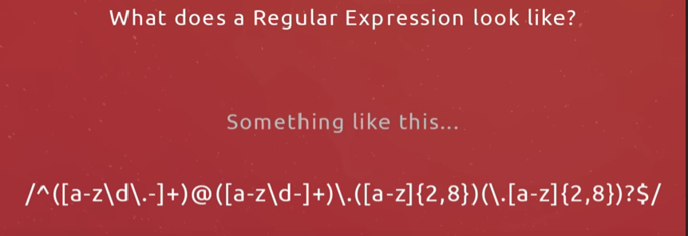

# Regex (Regular Expression Notes)

1. Tool to find patterns in a string.
2. Use to validate user generated input, (validate text) and search through a large part text.
3. To check email address filled on form on your website.
4. Allows us to check series of characters for 'matches'
5. Allows us to check a form field to try and match a valid email address

- It must have an @ symbol at a certain position
- It must end in an extension like .com or .org or co.uk

6. Regular expressions allow us to check these kinds of things.

### Interview question

1. Replace occurence of a string.

