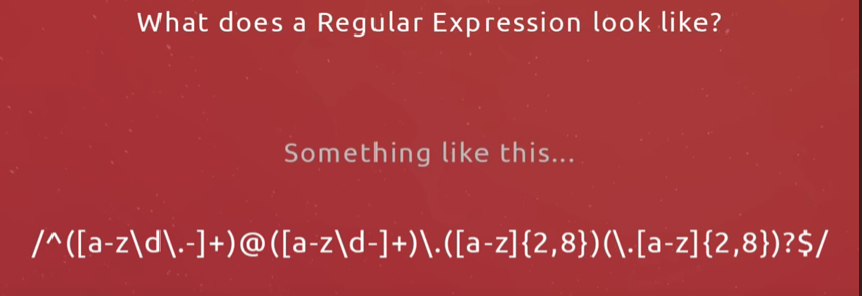

# Regex (Regular Expression Notes)

1. Tool to find patterns in a string.
2. Use to validate user generated input, (validate text) and search through a large part text.
3. To check email address filled on form on your website.
4. Allows us to check series of characters for 'matches'
5. Allows us to check a form field to try and match a valid email address, password, confirm-password, Name

- It must have an @ symbol at a certain position
- It must end in an extension like .com or .org or co.uk

6. Regular expressions allow us to check these kinds of things.

(Eloquent Js + Book) --> (start)

Regular expressions are a way to describe patterns in string data.

RegEx form a small & a separate language that is part of JS and many other languages and systems.

RegEx are powerful tool for inspecting and processing strings.
Properly understanding RegEx will make you more effective porgrammer.

RegEx is type of an object.
Can be constructed with `RegExp`constructor oe written as a literal value by enclosing a pattern in forward slash (/) characters.

### Creatinf regular expression

let re1 = new RegEcp("abc")
let re2 = /abc/;

### Testing for Matches

### Sets of Characters

### Repeating parts of pattern

### Grouping subexpressions

### Matches and groups

### The Data class

### Word and string Boundries

### Choice patterns

### Mechanism of matching

### Backtracking

### Replace Method

### Greed 

### Dynamically creating RegExp Objects

### Search Method

### Last index property

### Looping over matches 

### Parsing an ini file 

### International characters

(Eloquent Js + Book) --> (ends)

## Metacharacter's

- \d
- \w
- \s
- \t
- \d

## Special Characters

- '+'
- '\'
- '[]'
- '[^]'
- '?'
- '.'
- '\*'

### Interview question

1. Replace occurence of a string.

### Video's watched

1. cwh
2. Fireship
3. The Net Ninja

### Website used

https://regex101.com/

### Playlist

https://www.youtube.com/watch?v=C_HTKPvXjEc&list=PL4cUxeGkcC9g6m_6Sld9Q4jzqdqHd2HiD&index=4

